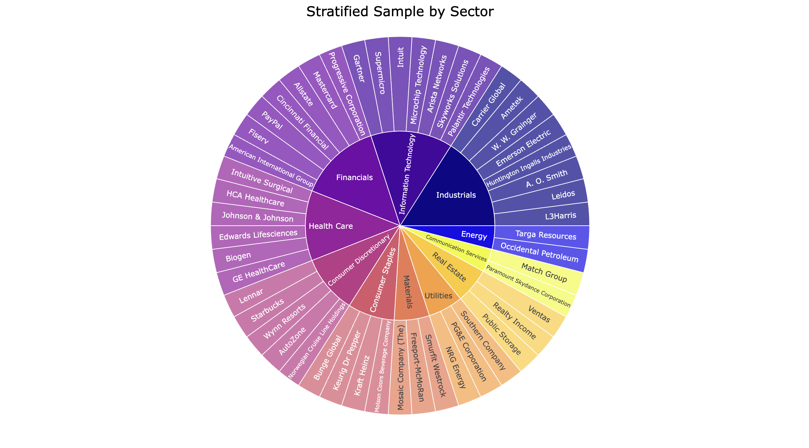

# S&P500 Rebounds 

## Overview

This project aims to analyze abnormal reactions of the S&P 500 stock shocks from 2015 to 2025. Specifically, it tests whether large market crashes are followed by **statistically significant positive returns**. 



## Setup

```bash
python -m venv venv
source venv/bin/activate  
pip install -r requirements.txt
jupyter notebook analysis.ipynb
```

Open `analysis.ipynb` and run cells in order.